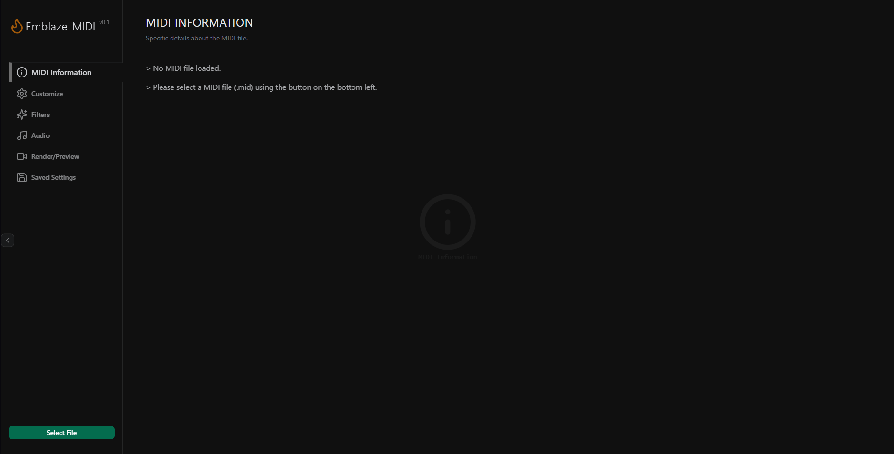
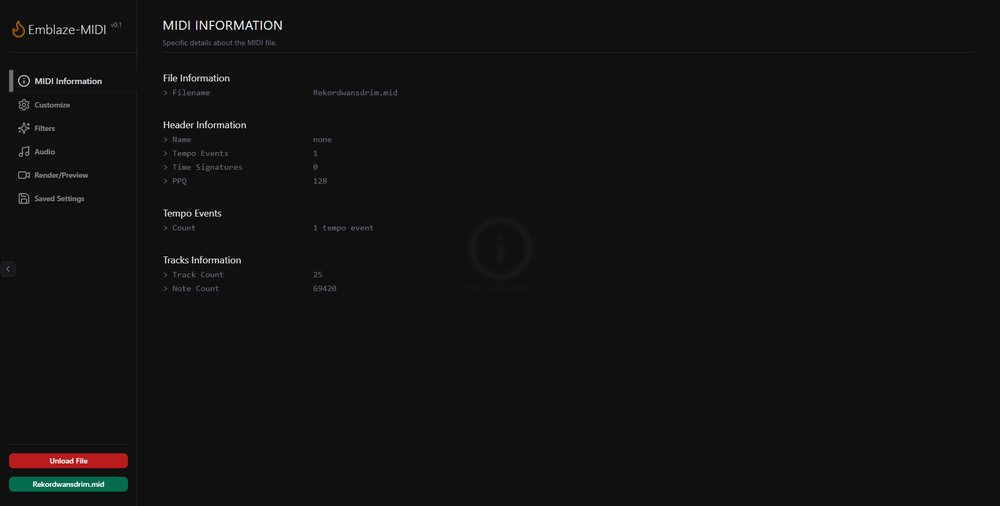
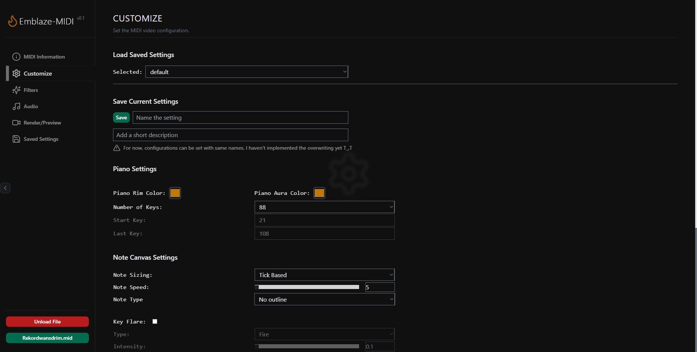
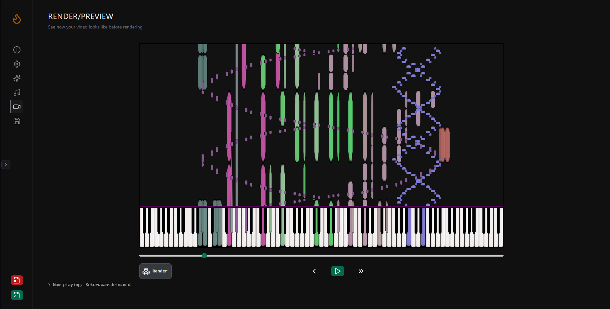
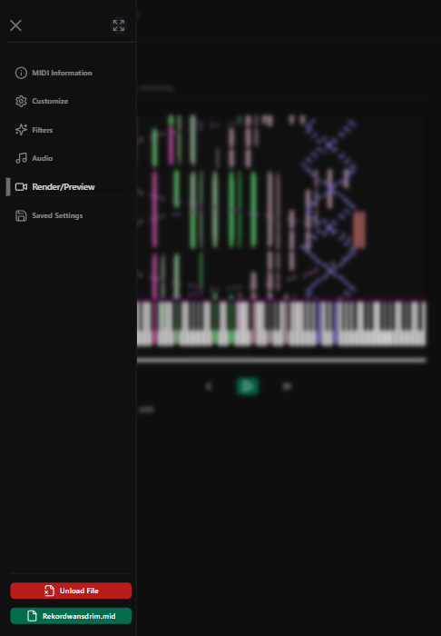
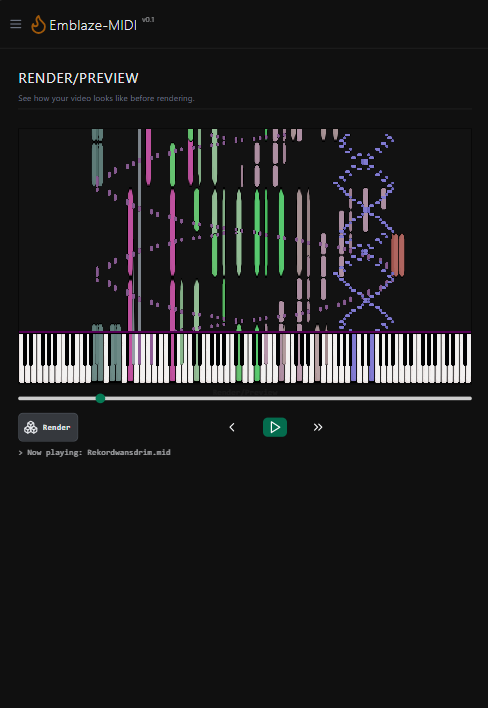

# Emblaze-MIDI

Emblaze-MIDI is a browser-based MIDI video renderer, inspired by [Zenith-MIDI](https://github.com/arduano/Zenith-MIDI) created by Arduano.

This is a revamp project of my [prototype MIDI renderer.](https://andrebryant.github.io/midi-visualizer/public/). This time, it is less laggy during playback and has a proper UI/UX.

<hr/>

## Motivation

I built Emblaze-MIDI for people who are passionate about sharing their musical arrangements online, but don’t have access to a powerful PC. With this browser-based renderer, anyone can create and export MIDI videos directly from their devices even on mobile, no desktop setup required, without complex `termux` configurations. Everything is on the browser, whatever they are currently using. However, please take note of the current limitations.

### Demo

Try it here: [Emblaze-MIDI Live Demo](https://emblaze-midi.vercel.app)

## Features

- Customizable **MIDI rendering** settings (number of keys, piano rim color, etc.)
- **MIDI parsing** with `ToneJS`
- **MIDI visualization** with `PixiJS`
- **Exports video** in `webm` format using `CCaptureJS`
- **Clean and intuitive UI/UX** built with `SvelteKit` and `TailwindCSS`

## Limitations

- MIDI paprsing of some files with dense events (i.e. millions of notes or black MIDIs) may take a long time to load.
- For best experience, the recommended MIDIs to render here are playable arrangements and small impossible arrangements that are not more than 750,000 notes.

## Some stuff

<details>
  <summary><b>Logs</b> <span style="font-size:12px">(Click to Expand)</span></summary>
  <blockquote>
    <ol>
      <li>Development started on August 2024 and stopped for a few months.</li>
      <li>Development resumed on July 2025, now with working UI features.</li>
    </ol>
  </blockquote>
</details>

<details>
    <summary><b>Screenshots</b> <span style="font-size:12px">(Click to Expand)</span></summary>
    <p align="center">
        
        
        
         <br/>
        
        
    </p>
</details>

<!-- # create-svelte

Everything you need to build a Svelte project, powered by [`create-svelte`](https://github.com/sveltejs/kit/tree/main/packages/create-svelte).

## Creating a project

If you're seeing this, you've probably already done this step. Congrats!

```bash
# create a new project in the current directory
npm create svelte@latest

# create a new project in my-app
npm create svelte@latest my-app
```

## Developing

Once you've created a project and installed dependencies with `npm install` (or `pnpm install` or `yarn`), start a development server:

```bash
npm run dev

# or start the server and open the app in a new browser tab
npm run dev -- --open
```

## Building

To create a production version of your app:

```bash
npm run build
```

You can preview the production build with `npm run preview`.

> To deploy your app, you may need to install an [adapter](https://kit.svelte.dev/docs/adapters) for your target environment. -->
